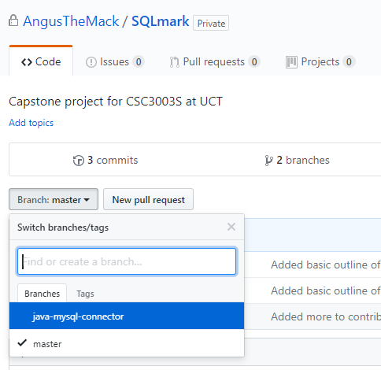

# Contributing <!-- omit in toc -->
- [Starting up](#starting-up)
- [Workflow](#workflow)
    - [Branching](#branching)
        - [Creating a branch](#creating-a-branch)
        - [Branch Naming](#branch-naming)
        - [Pushing your branch](#pushing-your-branch)
        - [Listing Branches](#listing-branches)
        - [Changing Branches](#changing-branches)
        - [Transferring changes from branch to master](#transferring-changes-from-branch-to-master)
        - [Deleting Branches](#deleting-branches)
- [Pull-Requests](#pull-requests)
- [Issues](#issues)
- [Queries](#queries)

This is a basic outline of how to add code to this repository. Generally, a contributing file on Github is used when people submit [pull requests](#pull-requests) or create [issues](#issues), those functionalities will still be there. However, we will be using this as a way to breakdown the structure of our development pipeline.

## Starting up
Go to the folder you want to develop in and run:
'''
git clone https://github.com/AngusTheMack/SQLmark.git
'''
This will download the files from the SQLmark repository and add them to your working direction. `clone` is simply a method for downloading the repository contents and initializing a repository with the correct git history, and it authorizes the user as well.

This will also set the branch to **master**. In order to check if everything worked you can simply `cd` into SQLmark and run `git status`. And it should look as follows:
```
angusm@DESKTOP-QT7DUCM:/mnt/c/Users/gusth/Code$ cd SQLmark/
angusm@DESKTOP-QT7DUCM:/mnt/c/Users/gusth/Code/SQLmark$ git status
On branch master
Your branch is up-to-date with 'origin/master'.
nothing to commit, working directory clean
angusm@DESKTOP-QT7DUCM:/mnt/c/Users/gusth/Code/SQLmark$
```

That is the basic startup, now lets get into the workflow.

## Workflow
If something is going on the **master** branch it should be:
* Reviewed by a teammate
* Unit Tested
* Compilable
* Deployable

This is because master is the base on which all the following deployments/changes will be made. It also allows for changes to be made on your own private branch without fear of breaking the product. Our workflow will be the Github-flow workflow. Effectively, you create a branch to do you work on - it gets reviewed, if it is okay you merge it back into master.

### Branching
#### Creating a branch
Before you create your own branch, it is best to ensure that the code on your machine is as up to date as possible with master. So, for safety sake run a `git pull` to ensure there are no lingering changes.

Then to create your own branch you simply need to run:
```git
git checkout -b <branch name>
```
This will create a branch on your local with whatever you inserted in `<branch name>`, and change the current branch from master to that branch.

The command is pretty descriptive, you basically stop *checking out* the current branch and start *checking out* the branch you want to switch to. The `-b` flag tells git to create a new branch to *checkout* with the given name
#### Branch Naming
A good practice when branching is to use a branch name that is a short descriptor of the work you are doing. So if you are implementing a java-mysql class, a good branch name might be as follows:
```git
git checkout -b java-mysql-connector
```
To demonstrate the functionality of the command, here is output from running the example above:
```bash
angusm@DESKTOP-QT7DUCM:/mnt/c/Users/gusth/Code/Capstone$ git checkout -b java-mysql-connector
Switched to a new branch 'java-mysql-connector'
angusm@DESKTOP-QT7DUCM:/mnt/c/Users/gusth/Code/Capstone$ git status
On branch java-mysql-connector
nothing to commit, working directory clean
```
As you can see after running the `git status` command, we are definitely on the `java-mysql-connector` branch. `git status` is a handy way of keeping track of which branch you are on, and whether you have any changes to commit.
#### Pushing your branch
It is a good practice to upload your code to the repo for various reasons. To do this you simply need to run:
```
git push --set-upstream origin java-mysql-connector
```
This will push your current working changes to the online repo. You can view the code on the github website by navigating to the repo homepage, and clicking on the `Branch: master` button, as shown below:


The command is pretty descriptive as well. `push` is used to notify the git client to move your code to the online repo. `--set-upstream` tells the git client which remote service you are going to be using. `origin` is the name of the remote service, and `java-mysql-connector` is the name of the branch. Once this command has been run for your branch you simply need to run `git push` and it will remember what the upstream was set to.

#### Listing Branches
To list the branches that are in your current git repo you can run 
```
git branch
```
with no other flags and all the branches will appear. Here is the output from the above example:
```
angusm@DESKTOP-QT7DUCM:/mnt/c/Users/gusth/Code/Capstone$ git branch
* java-mysql-connector
  master
```

#### Changing Branches
Changing branches uses the `checkout` command. 
From the example above, we have two branches and are currently on the `java-mysql-connector` branch. In order to change over to `master` you would run the command.
```
git checkout master
```
#### Transferring changes from branch to master
This must only be done if the following requirements have been met.
* A teammate has reviewed the code to be added
* There is 100% path coverage in unit testing
* It compiles successfully
* It can be deployed

Checkout the master branch, run a `git pull` on that for safety as well. Then run:
```
git checkout <branch-name>
git rebase master
```
Where branch-name is the name of the branch you have been working on. For the above example this will be as follows:
```
angusm@DESKTOP-QT7DUCM:/mnt/c/Users/gusth/Code/Capstone$ git checkout java-mysql-connector
angusm@DESKTOP-QT7DUCM:/mnt/c/Users/gusth/Code/Capstone$ git rebase master
First, rewinding head to replay your work on top of it...
Fast-forwarded java-mysql-connector to master.
```
You can verify these changes by simply looking at the files you changed to see if they are still there.

**How it works** - From [git](https://git-scm.com/book/en/v2/Git-Branching-Rebasing)
> It works by going to the common ancestor of the two branches (the one you’re on and the one you’re rebasing onto), getting the diff introduced by each commit of the branch you’re on, saving those diffs to temporary files, resetting the current branch to the same commit as the branch you are rebasing onto, and finally applying each change in turn.


**Merges Failures** git is not entirely perfect. If two copies of the same code have different changes it doesn't know which one to choose. There is a chance of this happening on any project. With the `git rebase` command, this can be a problem because you have to sort through every commit you made on the branch and verify if it has any merge conflicts on it before it can rebase. Which can be tedious.

There is another method of adding the branch to `master` and that is via the `git merge` command. You can run:
```
git checkout master
git merge <branch-name>
```
**Note:** there are merge conlifcts this won't necessarily fix them - it just might be a little less painful.
#### Deleting Branches
There might be a situation where you want to delete a branch. To delete a local branch you can run:
```
git branch -d <branch-name>
```
To delete the branch if it is on the remote you can run:
```
git push <remote-name> --delete <branch-name>
```
If we were to follow on from the previous examples the local command would be as follows:
```
git branch -d java-mysql-connector
```
Which gives the output:
```
angusm@DESKTOP-QT7DUCM:/mnt/c/Users/gusth/Code/Capstone$ git branch -d java-mysql-connector
Deleted branch java-mysql-connector (was a8c39ba).
```
Then for the remote deletion you would run:
```
git push origin --delete java-mysql-connector
```
which gives the output:
```
angusm@DESKTOP-QT7DUCM:/mnt/c/Users/gusth/Code/Capstone$ git push origin --delete java-mysql-connectorUsername for 'https://github.com': AngusTheMack
Password for 'https://AngusTheMack@github.com':
To https://github.com/AngusTheMack/SQLmark.git
 - [deleted]         java-mysql-connector
 ```

## Pull-Requests
If you log I pull request I will also try to get back to you as soon as possible.
## Issues
If you have any issues, please don't hesitate to create one and I will attempt to check it out as soon as possible.
## Queries
If you have any other queries at all, please feel free to contact me [here](mailto:mckang009@myuct.ac.za)