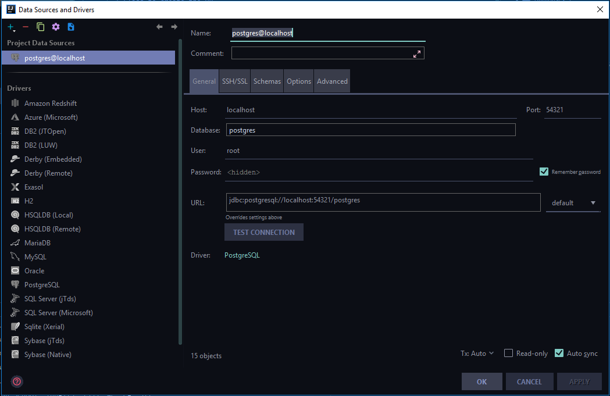

# Database Setup
We used Vagrant in order to create a database. This was necessary as it would allow all of us to have the same database setup regardless of our computer. According to the [Hashicorp documentation](https://www.vagrantup.com/intro/index.html) Vagrant is described as follows:
> Vagrant is a tool for building and managing virtual machine environments in a single workflow. With an easy-to-use workflow and focus on automation, Vagrant lowers development environment setup time, increases production parity, and makes the "works on my machine" excuse a relic of the past.

We used Boydan's [i-vagrant](https://github.com/bogdanvlviv/i-vagrant) as a base because it uses a large number of scripts to speed up deployment. We only incorporated his `Postgresql` scripts and created our own script that opens the database server up for connections. For our demo, we simply used the username `root` and password `admin`.
## How To Run
1. Install [Virtualbox ](https://www.virtualbox.org/wiki/Downloads)
2. Install [Vagrant](https://www.vagrantup.com/downloads.html)
3. Restart your computer
4. Ensure your internet connection is working
5. Open a terminal in the `SQLmark/vagrant` directory
6. Run: `vagrant up`
7. Wait approximately 20 mins (This is dependent on your computer's speed, and internet connection)

Once that has happened, and you have received no build errors, your database will be up and running. To ensure it is working use IntelliJ.
In IntelliJ, click: **View -> Tools Window -> Databases**

From there, click the **+** icon, select **Data Source** and use **Postgresql** as the type. Then ensure the properties looks as follows:

## How To Stop
Vagrantboxes will keep running until you tell them not to. In order to stop your server, simply open a terminal in the `SQLmark/vagrant` directory and type `vagrant halt`.

When you need your server again, open a terminal in the same directory and retype `vagrant up`
## Method Followed
We used a basic Vagrantfile, which creates an Ubuntu virtual machine with Postgresql installed on it - it creates a user and then forwards the server to port `54321` on your localhost.